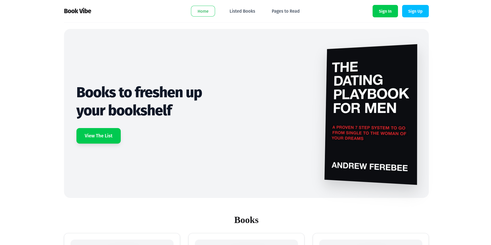
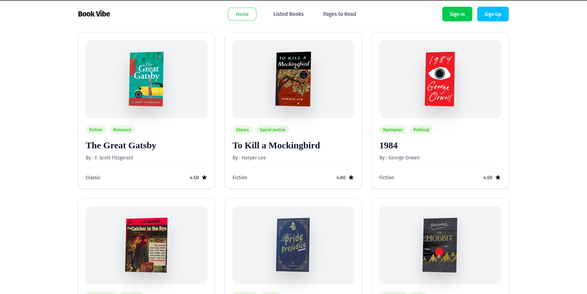
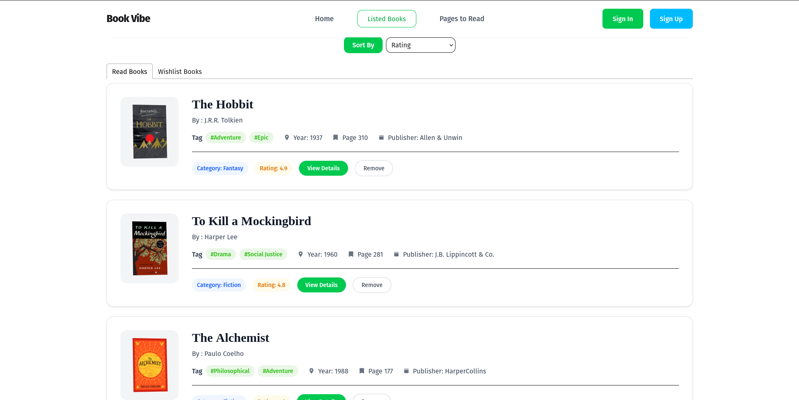
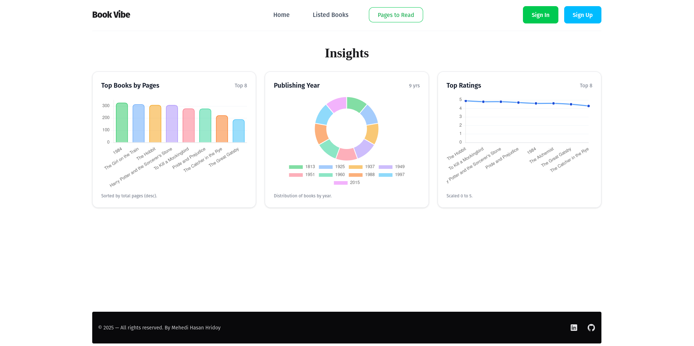
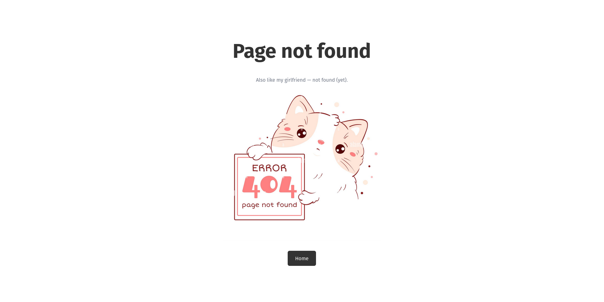

# Book Vibe — Modern React Bookshelf App

## 🔴 Live Demo

https://shimmering-cannoli-0089c9.netlify.app/

A polished, mobile‑first React app built with Vite that helps users browse books, view details, and manage personal lists (Read and Wishlist) with a clean UI, subtle motion, and thoughtful UX.

## ✨ Highlights
- Pixel‑perfect hero, navbar, and book cards with responsive layouts and smooth 3D image tilts
- Book details page with rich metadata, tags, and clear CTAs
- Listed Books (Read/Wishlist) with sorting, removal, and deep links
- Friendly toasts for feedback on actions (add/read/remove)
- Insights page with modern charts (pages, ratings, publishing years)
- Minimal, cute 404 with a playful message and Home routing

## 📸 Screenshots











## 🧰 Tech Stack
- React + Vite
- React Router DOM (v7)
- Tailwind CSS + DaisyUI
- react-toastify
- chart.js + react-chartjs-2

## 🚀 Getting Started

Prerequisites:
- Node.js 18+ (recommended)

Install and run:
```bash
npm install
npm run dev
```
The app will start on the Vite dev server (e.g., `http://localhost:5173`).

## 🗺️ App Structure

```
src/
	components/
		Banner/            # Hero with CTA (smooth-scroll to Books)
		Book/              # Book card
		BookDetail/        # Detailed view with metadata & actions
		Books/             # Books grid (fetches from public JSON)
		Dashboard/
		ErrorPage/         # Minimal 404 with playful line & Home button
		Footer/            # Clean footer with LinkedIn/GitHub
		Home/              # Home shell (Banner + Books)
		ListedBooks/       # Read & Wishlist tabs with sort & remove
		Navbar/            # Sticky, responsive, active-pill navigation
		PAGES/             # Charts & analytics page
		Root/              # App shell (Navbar, Outlet, Footer, Toasts)
	utility/
		addtoDb.js         # LocalStorage helpers + toast messages
public/
	booksData.json       # Data source for books
```

## 🔗 Routes
- `/` — Home
- `/books/:bookId` — Book details (loader fetch from `/booksData.json`)
- `/listedBooks` — Read/Wishlist with sorting and removal
- `/pages` — Charts & analytics (pages, ratings, years)
- Any unknown route — Error (404) page

## 📊 Features in Detail

### 1) Home: Banner and Books Grid
- Hero with two-line headline and green CTA “View The List”
- CTA smoothly scrolls to the `Books` section
- Grid of book cards (responsive: 1/2/3 cols)
- Card details: image with 3D tilt, tags, serif title, author, dashed divider, category chip, numeric rating with a single black star

### 2) Book Detail Page
- Large angled image on a light panel
- Structured metadata (pages, publisher, year, rating)
- Tag chips and review text
- Actions: “Mark As Read” and “Add to Wishlist” (with toast feedback & duplicate guards)

### 3) Listed Books (Read/Wishlist)
- Two tabs (react-tabs): Read Books and Wishlist Books
- Each row shows a small angled image, title, author, tags, and metadata
- Sorting by Rating, Number of Pages, or Publishing Year
- Actions: “View Details” and “Remove” per item
- Local persistence via `localStorage`

### 4) Insights (Charts)
- Built with `chart.js` + `react-chartjs-2`
- Bar: Top books by total pages (top 8)
- Doughnut: Publishing year distribution
- Line: Top ratings (top 8)
- Responsive cards with subtle, modern styling

### 5) Navigation & 404
- Sticky navbar with active-pill styles on all links
- Compact buttons and brand sizing for small screens
- Sign In / Sign Up link to Not Found page (placeholder for future auth)
- 404 page: “404 — Page not found” with a playful subline and Home button

## 💾 Data & Persistence
- Source: `public/booksData.json` (served by Vite at `/booksData.json`)
- Fields used per book:
	- `bookId`, `bookName`, `author`, `image`, `review`, `totalPages`, `rating`, `category`, `tags[]`, `publisher`, `yearOfPublishing`
- LocalStorage keys:
	- `read-list`, `wish-list`
- Utility (`src/utility/addtoDb.js`):
	- `addToStoredReadList(id)`, `addToStoredWishList(id)` — deduped, with success/info toasts
	- `removeFromStoredReadList(id)`, `removeFromStoredWishList(id)` — with success/info toasts

## 🧪 UX & Accessibility Notes
- Smooth scrolling to content from the hero CTA
- Focused, minimal 404 with clear recovery (Home)
- Accessible link labels for external icons (LinkedIn, GitHub)
- Alt texts for book images and decorative icons sized appropriately

## 🧠 What I Learned
- Building a clean component architecture in React with Vite
- React Router v7 loaders and data-driven routes
- Handling static assets and data via Vite’s `public` directory
- Tailwind + DaisyUI for rapid, consistent, responsive UI
- Managing local persistence with `localStorage` and clean helpers
- Integrating `react-toastify` for non-blocking UX feedback
- Chart.js registration patterns and responsive chart design
- Accessibility basics: alt text, aria labels, and keyboard-friendly components
- Dealing with transform and responsive quirks (e.g., using inline styles for reliable 3D tilts)

## ⚛️ What I Built With React
- Routing architecture with React Router v7
	- `createBrowserRouter` with nested routes and an `errorElement` for 404s
	- Dynamic route `/books/:bookId` using `useParams` and `useLoaderData`
	- Route loaders fetching `/booksData.json` for detail and list pages
	- Active navigation with `NavLink` (including `end` flag for exact Home match)
- State management with hooks
	- `useState` for read/wish lists, sorting key, fetched books
	- `useEffect` to hydrate lists from `localStorage` and to fetch books
	- `useMemo` to derive chart datasets (top pages, ratings, years) efficiently and satisfy hook dependency rules
- Component composition & props
	- Reusable `Book` card and a `Row` subcomponent in `ListedBooks`
	- Clean, presentational `Banner`, `Navbar`, `Footer`, and `ErrorPage` components
	- Data-driven UIs across pages powered by loader data and props
- Local persistence utilities
	- Pure helper functions in `utility/addtoDb.js` to add/remove/get IDs from `localStorage`
	- Duplicate guards, numeric ID normalization, and clear return values for UI decisions
- Feedback & UX polish
	- Global `<ToastContainer />` in `Root` and action toasts in storage helpers
	- Smooth scroll from hero CTA to `#books` via `scrollIntoView`
- Charts & analytics integration
	- Chart.js registration (`ChartJS.register(...)`) and react-chartjs-2 components (`<Bar/>`, `<Doughnut/>`, `<Line/>`)
	- Responsive chart cards with modern options and legends/tooltips
- Error states & fallbacks
	- Minimal, friendly 404 with a playful line and a Home action via `useNavigate`
	- Empty-state rendering in lists and charts

## 🔧 Implementation Notes
- Toast container is mounted in `src/components/Root/Root.jsx`
- Sticky navbar with top-center toasts offset to avoid overlap
- Active nav styles applied consistently (`NavLink` + `end` for Home)
- Sorting logic and duplicate guards kept in utilities and component state

## 📈 Possible Next Steps
- Real authentication (replace Sign In/Up placeholders)
- Search/filter across books
- Pagination or virtualized lists for very large datasets
- Dark mode and user preferences in `localStorage`
- Unit tests for helpers and rendering snapshots

## 🤝 Connect
- LinkedIn: https://www.linkedin.com/in/mehedi-hridoy/
- GitHub: https://github.com/mehedi-hridoy

---


